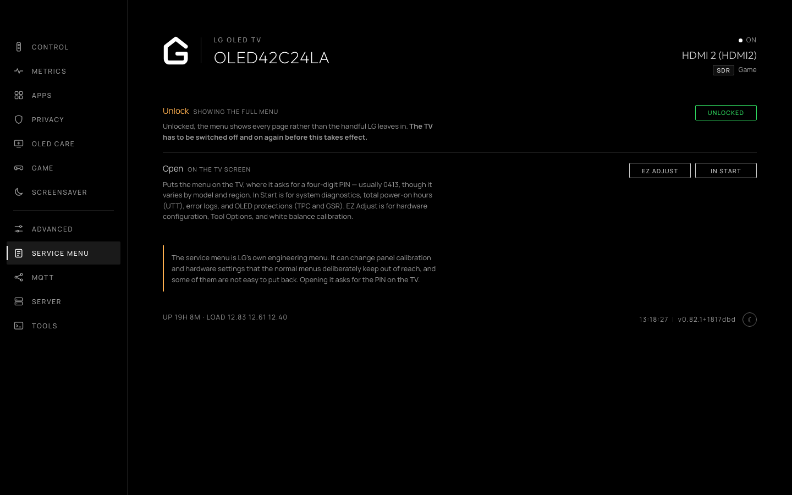

# Service menu access

The **Service menu** tab, `/?tab=servicemenu`, opens LG's engineering menu on the TV — EZ Adjust or In Start — without a service remote; the TV still asks for its PIN.

Newer firmware shows a cut-down version until it is unlocked, and the dashboard can unlock it. The TV has to be switched off and on again before that takes effect. TVs old enough not to lock it say so.

### EZ Adjust vs In Start

* **EZ Adjust**: The hardware configuration and calibration menu. Used for Tool Options (1–7), model and area/regional options, and factory white balance calibration.
* **In Start**: The factory diagnostic and telemetry menu. Used for inspecting system status, total power-on hours (UTT), firmware and SoC revisions, error logs, and OLED panel protections (such as disabling TPC and GSR auto-dimming).

> [!WARNING]
> The service menu provides low-level hardware and calibration control. Changing unfamiliar values in EZ Adjust or In Start can cause permanent display corruption or render the TV unbootable.

*Service menu access, unlock state and low-level hardware controls.*
