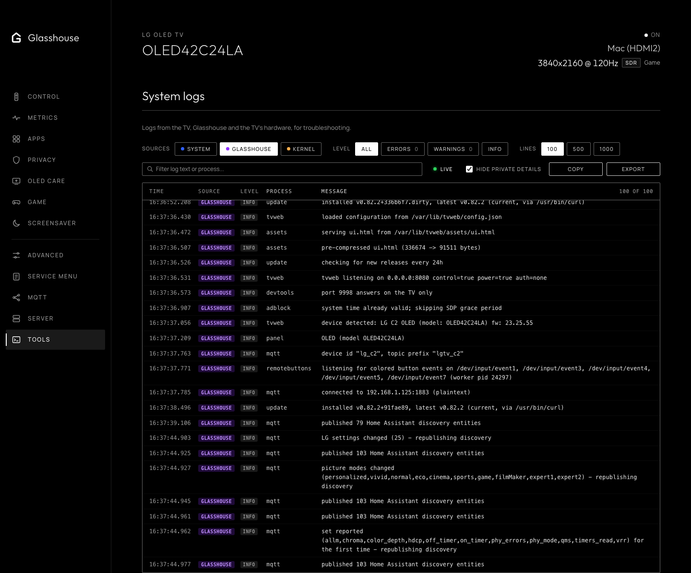

# System tools & logs

The **Tools** tab, `/?tab=tools`, provides a live system log inspection terminal for power users and developers to inspect system activity, service telemetry, and hardware diagnostics directly from the browser without requiring SSH.

### Log sources

* **System (`/var/log/messages`)**: webOS system daemon logs written by PmLogDaemon, tracking system services (e.g. `sam`, `audiooutputd`, `pqcontroller`, `fancontroller`).
* **Glasshouse (`/var/lib/tvweb/tvweb.log`)**: Output from the Glasshouse server, stamped with the TV's uptime so it interleaves with the other sources, and tagged `[INFO]`, `[WARN]`, `[ERR]` or `[DBG]`. When the file has just been trimmed, the lines kept from before are shown with it. A crash is written as `fatal:` lines with the error, its stack and the memory in use.
* **Kernel (`dmesg`)**: Linux kernel ring buffer, covering device drivers, thermal alerts, USB events, and network interfaces.

### Inspection features

* **Multi-source interleaving**: Merges lines from selected sources into a single unified timeline based on monotonic seconds since boot.
* **Filtering & search**: Instant search with match highlighting, plus severity level filters (All, Errors, Warnings, Info). Clicking the Error or Warning summary counters toggles that filter immediately.
* **Live view & pause**: The view follows new lines as they are written, fetching only what is new, and stops while the browser tab is hidden. It opens at the newest line; scrolling up holds it in place, and **Bottom** follows again.
* **Inspector drawer**: Clicking any log line expands detailed metadata and renders pretty-printed, syntax-highlighted JSON for structured webOS event payloads.
* **Export & copy**: The lines shown, after any filter, copied to the clipboard or saved as a timestamped `.txt` file for a bug report.
* **Redact**: Hides passwords, tokens, serial numbers, Wi-Fi network names, and MAC and IP addresses in the view, and in what is copied or exported. The logs can still name the apps in use, so it is worth reading them before posting.

### Log levels

How much the Glasshouse server writes is set in `/var/lib/tvweb/config.json`:

```json
"logging": { "level": "info" }
```

`info`, the default, writes the server's normal activity. `quiet` leaves that out and writes only warnings and errors. `debug` adds extra detail for troubleshooting, though few parts of the server write any yet. The level is read when the server starts, so a change takes effect after `/var/lib/tvweb/tvwebctl restart` or a reboot of the TV.



*Live webOS system logs, Glasshouse daemon events, and kernel ring buffer diagnostics.*
